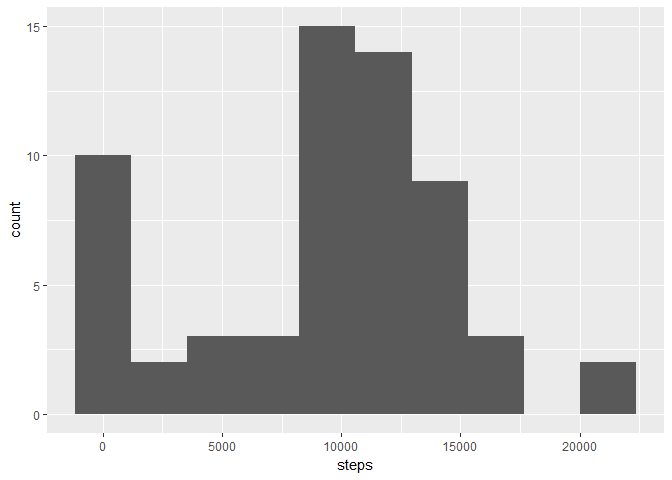
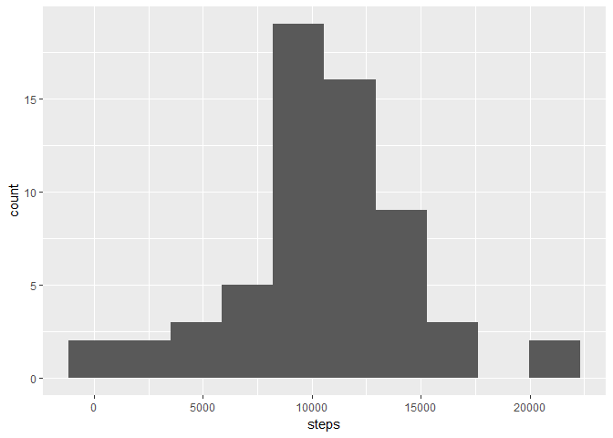

Report for the Course Project in Reproducible Research
================
Sven
21 September 2017

### Libraries

``` r
library(fasttime)
library(knitr)
library(ggplot2)
library(data.table)
setwd("C:\\Users\\Sven\\Desktop\\Coursera\\RepResearch\\RepData_PeerAssessment1\\")
opts_chunk$set(dev="png", fig.path="figure/")
```

### Loading and preprocessing the data

``` r
activity <- fread("activity.csv", na.strings="NA", colClasses = c("steps" = "double"))   #read data
activity[, date := fastPOSIXct(date)]                                                    #convert to date
```

### What is mean total number of steps taken per day?

``` r
activitygrouped <- activity[, .(steps = sum(steps, na.rm = T)), by="date"]             #aggregate by day
activitygrouped[, .(mean=mean(steps, na.rm = T), median=median(steps, na.rm = T))]     #Calculate and report the mean and median total number of steps taken per day
```

    ##       mean median
    ## 1: 9354.23  10395

``` r
ggplot(data=activitygrouped, aes(steps)) + geom_histogram(bins=10)                     #Histogram of the total number of steps taken each day
```



``` r
activity
```

    ##        steps                date interval
    ##     1:    NA 2012-10-01 02:00:00        0
    ##     2:    NA 2012-10-01 02:00:00        5
    ##     3:    NA 2012-10-01 02:00:00       10
    ##     4:    NA 2012-10-01 02:00:00       15
    ##     5:    NA 2012-10-01 02:00:00       20
    ##    ---                                   
    ## 17564:    NA 2012-11-30 01:00:00     2335
    ## 17565:    NA 2012-11-30 01:00:00     2340
    ## 17566:    NA 2012-11-30 01:00:00     2345
    ## 17567:    NA 2012-11-30 01:00:00     2350
    ## 17568:    NA 2012-11-30 01:00:00     2355

### What is the average daily activity pattern?

``` r
steps <- activity[, .(mean = mean(steps, na.rm = T)), by = "interval"]
ggplot(steps, aes(x=interval, y=mean)) +  geom_line()            #Time series plot of the average number of steps taken
```


``` r
steps[which.max(mean)]                                    #The 5-minute interval that, on average, contains the maximum number of steps
```

    ##    interval     mean
    ## 1:      835 206.1698

### Imputing missing values

``` r
activity[is.na(steps), .N]                                                              # Total Number of rows with missing values
```

    ## [1] 2304

``` r
activity_imputed <- activity[, .(date, steps, interval, MeanSteps = mean(steps, na.rm = T)), by=.(week = data.table::week(date))]    # calculate mean of week
activity_imputed[is.na(steps), steps := MeanSteps][, MeanSteps := NULL]                 # replace missing values with mean 
activity_imputed_agg <- activity_imputed[, .(steps = sum(steps, na.rm = T)), by="date"]     # aggregate by day
activity_imputed_agg[, .(mean=mean(steps, na.rm = T), median=median(steps, na.rm = T))]     # Calculate and report the mean and median total number of steps taken per day
```

    ##        mean median
    ## 1: 10607.97  10571

``` r
ggplot(data=activity_imputed_agg, aes(steps)) + geom_histogram(bins=10)                     # Histogram of the total number of steps taken each day
```



Imputing increase the mean and median value!

### Are there differences in activity patterns between weekdays and weekends?

``` r
activity_imputed[, weekday := as.factor(ifelse(weekdays(fastPOSIXct(date)) %in% c("Samstag", "Sonntag"), "weekend", "weekday"))]
activity_imputed_week <- activity_imputed[, .(mean = mean(steps, na.rm = T)), by = c("weekday","interval")]
ggplot(activity_imputed_week, aes(x=interval, y=mean)) +  
        geom_line() +           #Time series plot of the average number of steps taken
        facet_wrap(~weekday, ncol = 1)
```


